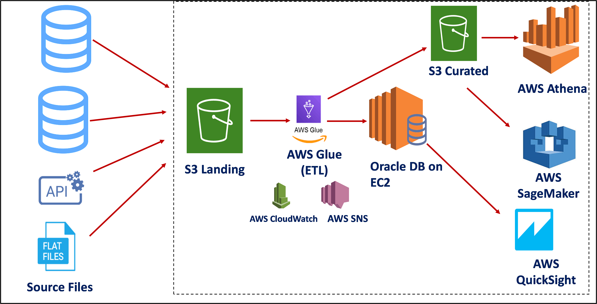

# Dự Án Nghiên Cứu Dữ Liệu

## Giới thiệu
Chào mừng đến với Dự Án Nghiên Cứu Dữ Liệu! Repository này chứa tập hợp các tài liệu nghiên cứu tập trung vào các hệ thống và quy trình quản lý dữ liệu khác nhau.

## Mục đích
Mục đích của dự án này là cung cấp hiểu biết toàn diện về các khái niệm dữ liệu khác nhau, bao gồm kho dữ liệu, dữ liệu có cấu trúc, hồ dữ liệu, quy trình ETL và Amazon S3. Mỗi chủ đề được trình bày trong file markdown riêng biệt, cho phép dễ dàng điều hướng và hiểu rõ.

## Điều hướng

### Section 1:

- **[Structured Data](/1-overview/data-structured.md)**: Tìm hiểu về đặc điểm, ví dụ và tổ chức dữ liệu có cấu trúc trong cơ sở dữ liệu.
- **[Data Warehouse](/1-overview/data-warehouse.md)**: Khám phá kiến trúc, trường hợp sử dụng và lợi ích của kho dữ liệu trong quản lý dữ liệu.
- **[Data Lake](/1-overview/data-lake.md)**: Hiểu về mục đích, ưu điểm và sự khác biệt giữa hồ dữ liệu và kho dữ liệu.
- **[So sánh Structured Data, Data Warehouse, Data Lake](/1-overview/so-sanh-data-structured-data-lake-va-data-warehouse.md.md)**
- **[ETL (Trích xuất, Chuyển đổi, Tải)](/1-overview/etl.md)**: Tìm hiểu sâu về quy trình ETL, bao gồm các bước, công cụ và phương pháp tốt nhất cho tích hợp dữ liệu.
- **[Amazon S3](/1-overview/s3.md)**: Khám phá các tính năng, trường hợp sử dụng và ứng dụng của Amazon S3 cho lưu trữ và quản lý dữ liệu.
- **[AWS Glue](/1-overview/aws-glue.md)**: Tìm hiểu về AWS Glue, một dịch vụ ETL được quản lý hoàn toàn giúp đơn giản hóa việc chuẩn bị và tải dữ liệu cho phân tích.

### Section 2:
- [Demo Glue - MinhVN](https://1drv.ms/v/s!Ar6KZyYMZxSF3BXcNcqRubW5tO8Z?e=v0eOjn)  
- [Treasure_Training_20112024](https://1drv.ms/v/s!Ar6KZyYMZxSF3BSdmymIH1uX6fV9?e=MtMcFV)  

### Section 3:
- [Treasure_Training_22112024](https://1drv.ms/v/s!Ar6KZyYMZxSF3BjfVZSN2ibqyAe4?e=dXnSip)  

### Section 4:
- [Treasure_Training_22112024](https://1drv.ms/u/s!Ar6KZyYMZxSF3BaojPshdo23lArY?e=Ki6a1U)

## Bắt đầu
Để bắt đầu, chỉ cần nhấp vào các liên kết ở trên để truy cập các chủ đề cụ thể bạn quan tâm. Mỗi file chứa thông tin chi tiết để nâng cao hiểu biết của bạn về hệ thống quản lý dữ liệu.

## Đóng góp
Hãy tự nhiên đóng góp cho dự án này bằng cách thêm các chủ đề mới hoặc cải thiện nội dung hiện có. Đóng góp của bạn rất có giá trị trong việc nâng cao cơ sở kiến thức.
