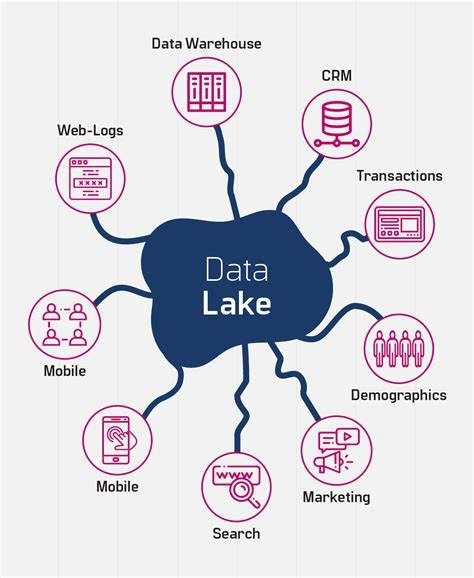

# Hồ Dữ Liệu (Data Lake)

## Tổng quan
Hồ dữ liệu là một kho lưu trữ tập trung cho phép bạn lưu trữ tất cả dữ liệu có cấu trúc và phi cấu trúc ở bất kỳ quy mô nào. Khác với các kho dữ liệu truyền thống, hồ dữ liệu có thể xử lý khối lượng lớn dữ liệu thô ở định dạng gốc cho đến khi cần phân tích.

## Mục đích
Mục đích chính của hồ dữ liệu là cung cấp giải pháp linh hoạt và có thể mở rộng để lưu trữ dữ liệu có thể được sử dụng cho các ứng dụng phân tích và machine learning khác nhau. Nó cho phép các tổ chức khai thác sức mạnh của big data mà không bị ràng buộc bởi các schema được định nghĩa trước.

## Ưu điểm
- **Khả năng mở rộng**: Hồ dữ liệu có thể mở rộng theo chiều ngang, cho phép lưu trữ petabyte dữ liệu.
- **Hiệu quả chi phí**: Lưu trữ dữ liệu ở dạng thô có thể tiết kiệm chi phí hơn các giải pháp kho dữ liệu truyền thống.
- **Tính linh hoạt**: Hồ dữ liệu hỗ trợ nhiều loại dữ liệu khác nhau, bao gồm dữ liệu có cấu trúc, bán cấu trúc và phi cấu trúc.
- **Xử lý thời gian thực**: Chúng cho phép xử lý và phân tích dữ liệu thời gian thực, giúp dễ dàng rút ra thông tin chi tiết nhanh chóng.

## Khác biệt với Kho Dữ Liệu (Data Warehouse)
- **Schema**: Hồ dữ liệu lưu trữ dữ liệu ở dạng thô không cần schema được định nghĩa trước, trong khi kho dữ liệu yêu cầu schema có cấu trúc.
- **Loại dữ liệu**: Hồ dữ liệu có thể xử lý nhiều loại dữ liệu đa dạng hơn so với kho dữ liệu, vốn chủ yếu tập trung vào dữ liệu có cấu trúc.
- **Trường hợp sử dụng**: Hồ dữ liệu thường được sử dụng cho phân tích big data, machine learning và khám phá dữ liệu, trong khi kho dữ liệu thường được sử dụng cho business intelligence và báo cáo.

## Kết luận
Hồ dữ liệu đại diện cho cách tiếp cận hiện đại trong việc lưu trữ và quản lý dữ liệu, cung cấp cho các tổ chức tính linh hoạt và khả năng mở rộng cần thiết để tận dụng dữ liệu một cách hiệu quả. Khi doanh nghiệp tiếp tục tạo ra khối lượng dữ liệu khổng lồ, hồ dữ liệu sẽ đóng vai trò quan trọng trong việc hỗ trợ ra quyết định dựa trên dữ liệu.