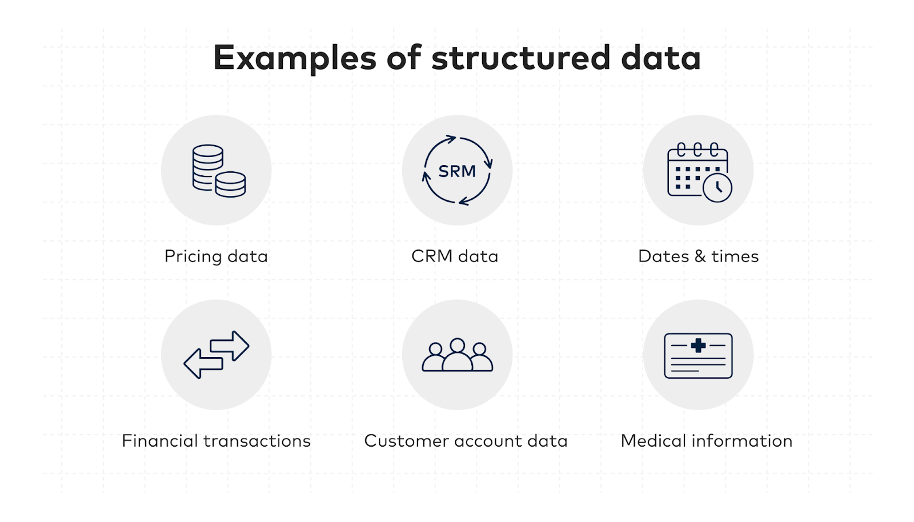

# Dữ Liệu Có Cấu Trúc (Structured Data)

## Giới thiệu
Dữ liệu có cấu trúc là thông tin được tổ chức theo một schema hoặc mô hình dữ liệu xác định. Loại dữ liệu này thường được lưu trữ trong các cơ sở dữ liệu quan hệ và tuân theo các quy tắc định dạng nghiêm ngặt.

## Đặc điểm
- Được tổ chức trong rows và columns
- Có schema được xác định trước
- Dễ dàng tìm kiếm và phân tích
- Thường được lưu trữ trong SQL databases
- Có quan hệ rõ ràng giữa các phần tử dữ liệu

## Ví dụ
- Bảng trong cơ sở dữ liệu SQL
- Bảng tính Excel
- Dữ liệu giao dịch
- Thông tin khách hàng có cấu trúc

## Lợi ích
- Dễ dàng tổ chức và quản lý
- Hiệu quả trong việc truy vấn
- Tính nhất quán cao
- Phù hợp cho phân tích dữ liệu

## Công nghệ liên quan
- MySQL
- PostgreSQL
- Oracle Database
- Microsoft SQL Server
- IBM Db2